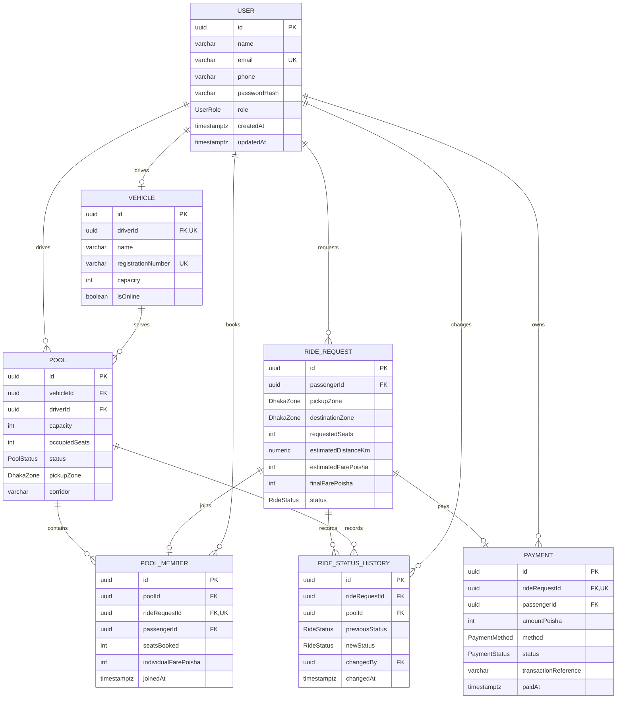

# Entity Relationship Diagram

```mermaid
erDiagram
    USER ||--o| VEHICLE : drives
    USER ||--o{ RIDE_REQUEST : requests
    USER ||--o{ POOL : drives
    VEHICLE ||--o{ POOL : serves
    POOL ||--o{ POOL_MEMBER : contains
    RIDE_REQUEST ||--o| POOL_MEMBER : joins
    USER ||--o{ POOL_MEMBER : books
    RIDE_REQUEST ||--o{ RIDE_STATUS_HISTORY : records
    POOL ||--o{ RIDE_STATUS_HISTORY : records
    USER ||--o{ RIDE_STATUS_HISTORY : changes
    RIDE_REQUEST ||--o| PAYMENT : pays
    USER ||--o{ PAYMENT : owns

    USER {
      uuid id PK
      varchar name
      varchar email UK
      varchar phone
      varchar passwordHash
      UserRole role
      timestamptz createdAt
      timestamptz updatedAt
    }
    VEHICLE {
      uuid id PK
      uuid driverId FK,UK
      varchar name
      varchar registrationNumber UK
      int capacity
      boolean isOnline
    }
    RIDE_REQUEST {
      uuid id PK
      uuid passengerId FK
      DhakaZone pickupZone
      DhakaZone destinationZone
      int requestedSeats
      numeric estimatedDistanceKm
      int estimatedFarePoisha
      int finalFarePoisha
      RideStatus status
    }
    POOL {
      uuid id PK
      uuid vehicleId FK
      uuid driverId FK
      int capacity
      int occupiedSeats
      PoolStatus status
      DhakaZone pickupZone
      varchar corridor
    }
    POOL_MEMBER {
      uuid id PK
      uuid poolId FK
      uuid rideRequestId FK,UK
      uuid passengerId FK
      int seatsBooked
      int individualFarePoisha
      timestamptz joinedAt
    }
    RIDE_STATUS_HISTORY {
      uuid id PK
      uuid rideRequestId FK
      uuid poolId FK
      RideStatus previousStatus
      RideStatus newStatus
      uuid changedBy FK
      timestamptz changedAt
    }
    PAYMENT {
      uuid id PK
      uuid rideRequestId FK,UK
      uuid passengerId FK
      int amountPoisha
      PaymentMethod method
      PaymentStatus status
      varchar transactionReference
      timestamptz paidAt
    }
```

